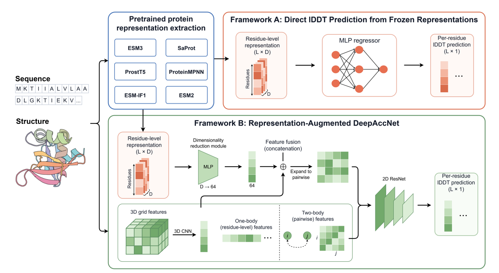

# ProteinRep-MQA

**ProteinRep-MQA** is a systematic evaluation framework for investigating
structural model quality signals encoded in pretrained protein representations.

The framework evaluates pretrained representations from six protein models,
including ESM-2, ESM-3, SaProt, ProstT5, ESM-IF1, and ProteinMPNN, and examines
three complementary aspects of their utility for protein model quality
assessment:

1. **Representation-space sensitivity** - whether structural quality is
   reflected in pretrained representation spaces.
2. **Direct quality decodability** - whether residue-level model quality can be
   predicted directly from frozen pretrained representations using a lightweight
   prediction head.
3. **Feature complementarity** - whether pretrained representations provide
   additional information when integrated with the established DeepAccNet
   framework.

## Overview

<p align="center">
  
</p>

ProteinRep-MQA evaluates pretrained protein representations through native-decoy
representation-space analysis, direct quality decoding from frozen
representations (Framework A), and representation-augmented DeepAccNet
(Framework B).

## Models

| Model | Checkpoint | Representation | Standalone head | DeepAccNet projection |
| --- | --- | ---: | --- | --- |
| ESM-2 | `esm2_t33_650M_UR50D` | `L x 1280` | - | 512-256-64 |
| ESM-3 | `esm3-open` | `L x 1536` | 512-256-128 | 512-256-64 |
| SaProt | `SaProt_650M_AF2` | `L x 1280` | 512-256-128 | 512-256-64 |
| ProstT5 | `Rostlab/ProstT5` | `L x 1024` | 512-256-128 | 512-256-64 |
| ESM-IF1 | `esm_if1_gvp4_t16_142M_UR50` | `L x 512` | 512-256-128 | 512-256-64 |
| ProteinMPNN | `v_48_020` | `L x 128` | 512-256-128 | 512-256-64 |

The default standalone predictor reproduces the MLP architecture used in the
study. An optional linear prediction head is available with `--head linear`.
ProteinMPNN is a structure-conditioned sequence-design model rather than a
protein language model, but its encoder representation is handled through the
same interface.

The merged DeepAccNet implementation is checkpoint-compatible with the
representation-augmented DeepAccNet models used in the experiments.

## Installation

Create the training environment from the repository root:

```bash
conda env create -f environments/core.yml
conda activate mqa-core
```

The environment file installs this repository in editable mode through
`pip -e .`. If the command-line tools are not available, or after editing the
source code, rerun:

```bash
python -m pip install -e .
```

Editable installation creates the following commands:

```text
mqa-extract
mqa-train-head
mqa-test-head
mqa-train-fusion
mqa-predict-fusion
```

Feature extraction uses separate reproducible environments because fair-esm and
ESM-3 both provide an `esm` Python package:

```bash
conda env create -f environments/esm2_esmif1.yml
conda env create -f environments/esm3.yml
conda env create -f environments/saprot.yml
conda env create -f environments/prostt5.yml
conda env create -f environments/proteinmpnn.yml
conda env create -f environments/deepaccnet.yml
```

See [environment notes](environments/README.md) for CUDA, Foldseek, PyRosetta,
and weight boundaries.

SaProt additionally requires the Foldseek executable. ProteinMPNN requires an
upstream [ProteinMPNN](https://github.com/dauparas/ProteinMPNN) checkout and its
`v_48_020.pt` checkpoint. DeepAccNet feature generation requires an upstream
[DeepAccNet](https://github.com/hiranumn/DeepAccNet) checkout and a separately
licensed PyRosetta installation.

## Feature Extraction

All extractors write compressed NPZ files with one required array:

```text
embedding: float32 [L, D]
```

Metadata such as `model_name`, `source`, `sequence`, and `chain_ids` is stored
when available.

Sequence models take FASTA input:

```bash
mqa-extract --feature esm2 --input proteins.fasta --output features/esm2
mqa-extract --feature prostt5 --input proteins.fasta --output features/prostt5
```

Structure models take one PDB/mmCIF file or a directory tree:

```bash
mqa-extract --feature esm3 --input structures --output features/esm3
mqa-extract --feature esmif1 --input structures --output features/esmif1
mqa-extract --feature saprot --input structures --output features/saprot \
  --model-path /path/to/SaProt_650M_AF2 --foldseek /path/to/foldseek
mqa-extract --feature proteinmpnn --input structures --output features/proteinmpnn \
  --proteinmpnn-repo /path/to/ProteinMPNN
```

ESM-3 processes all chains by default; pass `--chain A` to restrict it to one
chain. The other structure extractors also accept `--chain`.

The ProteinMPNN extractor captures the last encoder layer through a forward
hook, so the upstream repository does not need to be patched.

## Manifests

Training and testing are driven by CSV manifests, which keeps machine-specific
paths out of the source. Relative paths are resolved from the manifest file.

Standalone head manifest:

```csv
target,decoy,embedding,label
protein_1,model_1,features/protein_1/model_1.npz,labels/protein_1/model_1.json
```

Fusion manifest:

```csv
target,decoy,feature,embedding,native
protein_1,model_1,deepaccnet/protein_1/model_1.features.npz,features/protein_1/model_1.npz,deepaccnet/protein_1/native.features.npz
```

Labels may be JSON files with `local_lddt[chain][residue_index]` values, or NPZ
files with a `local_lddt`/`lddt` array and optional boolean `mask`. A helper can
build manifests from matching directory trees:

```bash
python scripts/build_manifest.py \
  --embedding-root features/esm3 \
  --label-root labels \
  --output manifests/esm3_train.csv
```

## Standalone Head

```bash
mqa-train-head \
  --feature esm3 \
  --train-manifest manifests/train.csv \
  --valid-manifest manifests/valid.csv \
  --output outputs/esm3_head

mqa-test-head \
  --checkpoint outputs/esm3_head/best.pt \
  --manifest manifests/test.csv \
  --output outputs/esm3_head_test
```

Testing writes `predictions.csv` with one row per protein model,
`residue_scores.csv` with one row per residue, `metrics.json`, and one NPZ
prediction file per model.

Use `--head linear` for the additional `Linear(D, 1)` baseline. For an old
state-dict-only checkpoint, add its representation name, for example
`--feature esm3`. The existing ESM-3, SaProt, ProstT5, ESM-IF1, and ProteinMPNN
head weights are supported without conversion. No historical standalone ESM-2
head is claimed here.

## DeepAccNet Fusion

DeepAccNet features must first be generated as `.features.npz` files with the
original DeepAccNet program. ProteinRep-MQA reads these files but does not
generate them.

```bash
mqa-train-fusion \
  --feature saprot \
  --train-manifest manifests/fusion_train.csv \
  --valid-manifest manifests/fusion_valid.csv \
  --output outputs/saprot_fusion

mqa-predict-fusion \
  --checkpoint outputs/saprot_fusion/best.pt \
  --manifest manifests/fusion_test.csv \
  --output outputs/saprot_fusion_test
```

Fusion prediction writes `predictions.csv` with one row per protein model,
`residue_scores.csv` with one row per residue, `predictions.json`, and one NPZ
prediction file per model. New fusion training runs save `last.pt` and
`best.pt` in the selected output directory.

Old experiment checkpoints may use a `.pkl` extension and may not contain
feature metadata. For one of those trusted legacy files only, supply the
matching feature and allow legacy pickle loading:

```bash
mqa-predict-fusion --checkpoint /path/to/best.pkl --feature esm3 \
  --manifest manifests/fusion_test.csv --output outputs/esm3_fusion_test \
  --allow-legacy-pickle
```

The final flag is required only for trusted historical DeepAccNet checkpoints
that contain NumPy training-history objects and cannot use PyTorch's restricted
weights-only loader.

## Data and Model Weights

The downstream fusion and standalone-head weights used in the previous
experiments are included under `weights/`.

| Feature | Fusion weight | Source epoch | Standalone head |
| --- | --- | ---: | --- |
| ESM-2 | `weights/fusion/esm2.pt` | 199 | Not available |
| ESM-3 | `weights/fusion/esm3.pt` | 186 | `weights/head/esm3.pt` |
| SaProt | `weights/fusion/saprot.pt` | 120 | `weights/head/saprot.pt` |
| ProstT5 | `weights/fusion/prostt5.pt` | 159 | `weights/head/prostt5.pt` |
| ESM-IF1 | `weights/fusion/esmif1.pt` | 173 | `weights/head/esmif1.pt` |
| ProteinMPNN | `weights/fusion/proteinmpnn.pt` | 199 | `weights/head/proteinmpnn.pt` |

Run a packaged fusion weight with:

```bash
mqa-predict-fusion \
  --checkpoint weights/fusion/esm3.pt \
  --manifest manifests/fusion_test.csv \
  --output outputs/esm3_fusion_test
```

Run a packaged standalone head with:

```bash
mqa-test-head \
  --checkpoint weights/head/prostt5.pt \
  --manifest manifests/prostt5_test.csv \
  --output outputs/prostt5_head_test
```

Large pretrained ESM-2, ESM-3, SaProt, ProstT5, ESM-IF1, and ProteinMPNN
backbone weights are not redistributed here. CASP datasets, structure files,
extracted tensors, and prediction outputs are also not included.

## External Resources

- [DeepAccNet](https://github.com/hiranumn/DeepAccNet)
- [ESM-2 and ESM-IF1](https://github.com/facebookresearch/esm)
- [ESM-3](https://github.com/evolutionaryscale/esm)
- [SaProt](https://github.com/westlake-repl/SaProt)
- [ProstT5](https://huggingface.co/Rostlab/ProstT5)
- [ProteinMPNN](https://github.com/dauparas/ProteinMPNN)

## Citation

If you find ProteinRep-MQA useful, please cite:

> Qihang Zhen, Lei Xie, Bo Li, Yang Zhang, Guijun Zhang, Jun Liu.
> **Pretrained protein representations encode signals of structural model quality.**
> Manuscript in preparation.

A BibTeX entry will be provided upon publication.
